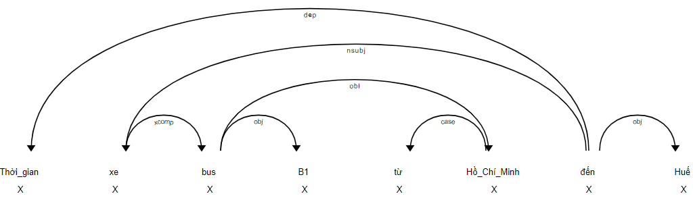

# Natural Language Processing Assignment
## A Simple Reply System

If you are reading the raw README.md, you'd better visit [This GitHub Project](https://github.com/ghostbbbmt/NLP2017_Assignment) to have a better, clearer README :)

### 1. Description
This project is a reply system about flights' information using natural language techniques. 

The input is a question in natural language (English and Vietnamese). The question will be analyzed to logical form, then the logical structure is parsed to procedure semantics form.

With a query as the above procedure semantics form, the system will lookup in the database and return the result of the input question.


### 2. Prerequisites:
- Python 3.5
- [NLTK 3.2](http://www.nltk.org) 
- If you currently using another Python version, I recommend to create virtual environments for python with conda, instruction in this following link: https://uoa-eresearch.github.io/eresearch-cookbook/recipe/2014/11/20/conda/

### 3. System structure
There are 4 python files as 4 modules:
- [main.py](main.py) : The start point of the program.
- [nlp_parser.py](nlp_parser.py) : Parser module. Include a function that parse logical structure to procedure semantics form.
- [nlp_data.py](nlp_data.py) : Database module. Define the given dataset and provide lookup function for answering the question.
- [nlp_file.py](nlp_file.py) : File module. Write answers to text files as required.
- [code_featstructures.py](code_featstructures.py): Variable Expression and Feature Struct Expression of the DFG tree
- [nlp_featstruct_parser.py](nlp_featstruct_parser.py): Include a function that parse DFG FeatStruct sematic logical structure to procedure semantics form.
Other files:
- [grammar.fcfg](grammar.fcfg) :(For English parser) The free context grammar file that defines grammar rules for parser. This contains not only all predefined rules from the assignment's description but contains also extra rules which I think necessary for grammar regulization and they help the parser can parse all the possible natural questions smoothly. All the rules are described by SEM structure which is close to the textbook. 
Some special cases:
  - VP, NP, N,... have their own VAR variable
  - WHQUERY has GAP
  - VP and some rules have lamda expression
 - 1712177.zip : The zip file contains submited project. 
 - [README.md](README.md) : This file, obiviously :)

### 4. Installation
#### Dependency grammar Installation:
1. Install spaCy
```bash 
pip install spacy==2.2.3
```
2. Install pyvi
```bash
pip install pyvi
```
3. Download vivi model directly using pip:
```bash 
pip install https://github.com/trungtv/vi_spacy/raw/master/packages/vi_spacy_model-0.2.1/dist/vi_spacy_model-0.2.1.tar.gz
```
Voila !! done </br>
But if you using anaconda virtual enviroment, the installation process is not yet done, Run this command or manually copy the vivi model package that you has just downloaded in step 3 into python package management (pip or something else) folder.
```bash 
python -m spacy link vi_spacy_model vi_spacy_model
```
##### spaCy doc
For more infomation please refer to https://spacy.io/usage for documentation
and https://spacy.io/api/annotation#pos-tagging (Syntactic Dependency Parsing/Universal Part-of-speech Tags) , https://universaldependencies.org/vi/dep/  for tag definition.
#### There are two ways of running the program:
Use default arguments:
```sh
python main.py
```
Use custom arguments: 
```sh
python main.py --question [question] --rule_file_name [rule_file_name] --language ['english','vietnamese'] --visualize ['on','off']
```
Usage:
- ```--question``` : The input question in English or Vietnamese. Default: "*Which flight to Huế city arrives at 20:00HR ?*"
-  ```--rule_file_name``` : The context free grammar file (.fcfg). Default: *grammar.fcfg*
- ``` --language ``` : english or vietnamese, (the default option is Vietnamese)
- ``` --visualize ``` : Visualize the SpaCy dependency tree with nltk.tree, you can choose to turn on or off this feature by pass this to command line --visualize 'on' (or 'off')  (the default option is "Off" )
#### Important note !!!
You might unable to run the program when input vietnamese text into the command line, and the debug console show something like this :
```
UnicodeEncodeError: 'charmap' codec can't encode characters in position 2-3: character maps to <undefined>
```
that because the command windows doesn't speak Vietnamese yet (at this time for sure, lmao). In order to fix that, you might want to try this command:
```sh
chcp 65001
```
also if it doesn't work try to set the config of your local machine's python to encoding='utf-8' it will also help to.

If the grammar rules is correct and the question can be parsed, all the results of 5 phases (*1.create parser, 2.create parsed tree, 3.create logical form, 4.create procedure semantics form, 5.query result*) will be printed as well as written to files.


### 5. Result
##### Database:
- These information are given from the assignment's description:
  - "(BUS B1)","(ATIME B1 HUE 22:00HR)","(DTIME B1 HCMC 10:00HR)","(RUN-TIME B1 HCMC HUE 12:00HR)"
  - "(BUS B2)","(ATIME B2 HUE 22:30HR)","(DTIME B2 HCMC 12:30HR)","(RUN-TIME B2 HCMC HUE 10:00HR)"
  - "(BUS B3)","(ATIME B3 HCMC 05:00HR)","(DTIME B3 DANANG 19:00HR)","(RUN-TIME B3 DANANG HCMC 14:00HR)"
  - "(BUS B4)","(ATIME B4 HCMC 5:30HR)","(DTIME B4 DANANG 17:30HR)","(RUN-TIME B4 DANANG HCMC 12:00HR)"
  - "(BUS B5)","(ATIME B5 DANANG 13:30HR)","(DTIME B5 HUE 08:30HR)","(RUN-TIME B5 HUE DANANG 5:00HR)"
  - "(BUS B6)","(ATIME B6 DANANG 9:30HR)","(DTIME B6 HUE 5:30HR)","(RUN-TIME B6 HUE DANANG 4:00HR)"
  - "(BUS B7)","(ATIME B7 HCMC 20:30HR)","(DTIME B7 HUE 8:30HR)","(RUN-TIME B7 HUE HCMC 12:00HR)"

##### Result of the assignment (default parameters):
Question:
```
Thời gian xe bus B1 từ Hồ Chí Minh đến Huế ?
```
Parsed tree (style: python list format) (in [output_b.txt](output_b.txt)) look something like this : 
```
[Tree('đến_V_ROOT', ['Thời_gian_N_dep', Tree('xe_N_nsubj', [Tree('bus_V_xcomp', ['B1_Ny_obj', Tree('Hồ_Chí_Minh_Np_obl', ['từ_E_case'])])]), 'Huế_Np_obj'])]
```
Console output
```
Token def.
a. token.text, b. token.lemma_, c. token.pos_, d. token.tag_, e. token.dep_, f.token.shape_, g. token.is_alpha, h. token.is_stop
0. a.Thời_gian, b.Thời_gian, c.X, d.N, e.dep, f.xxxxxxxxx, g.False, h.True
1. a.xe, b.xe, c.X, d.N, e.nsubj, f.xx, g.True, h.False
2. a.bus, b.bus, c.X, d.V, e.xcomp, f.xxx, g.True, h.False
3. a.B1, b.B1, c.X, d.Ny, e.obj, f.xx, g.False, h.False
4. a.từ, b.từ, c.X, d.E, e.case, f.xx, g.True, h.True
5. a.Hồ_Chí_Minh, b.Hồ_Chí_Minh, c.X, d.Np, e.obl, f.xxxxxxxxxxx, g.False, h.False
6. a.đến, b.đến, c.X, d.V, e.ROOT, f.xxx, g.True, h.True
7. a.Huế, b.Huế, c.X, d.Np, e.obj, f.xxx, g.True, h.False

NLTK spaCy Parse Tree
                đến_V_ROOT
        ____________|_____________________
       |            |                 xe_N_nsubj
       |            |                     |
       |            |                bus_V_xcomp
       |            |           __________|_____________
       |            |          |                 Hồ_Chí_Minh_Np_o
       |            |          |                        bl
       |            |          |                        |
Thời_gian_N_dep Huế_Np_obj B1_Ny_obj                từ_E_case

```
If you choose the --visualize 'on' parameter, you need to open your browser enter localhost:5000, the result show like this picture:  &nbsp;
``` console 
Using the 'dep' visualizer
Serving on http://0.0.0.0:5000 ...

127.0.0.1 - - [19/Aug/2020 09:55:38] "GET / HTTP/1.1" 200 6718
127.0.0.1 - - [19/Aug/2020 09:55:38] "GET /favicon.ico HTTP/1.1" 200 6718
``` 
 </br>
When you finish observe, press Ctrl+C in command line console to turn off and re-run the python script without --visualize 'on' &nbsp;

Parsed logical form (in [output_c.txt](output_c.txt)) with only sem feature, but the console also show var and gap feature.
```
-------------Parsed logical form-------------
[ gap = 'r2'                                                                         ]
[                                                                                    ]
[       [         [      [       [ bus     = 'f2'            ] ]                 ] ] ]
[       [         [ np = [ the = [                           ] ]                 ] ] ]
[       [         [      [       [ busname = [ h    = 'h3' ] ] ]                 ] ] ]
[       [         [      [       [           [ name = 'B1' ] ] ]                 ] ] ]
[       [         [                                                              ] ] ]
[       [         [      [          [ a = 'a3'                   ]             ] ] ] ]
[       [         [      [          [ f = 'f2'                   ]             ] ] ] ]
[       [         [      [ arrive = [                            ]             ] ] ] ]
[       [         [      [          [ t = [ t_var    = '?t'    ] ]             ] ] ] ]
[       [         [      [          [     [ time_var = '?time' ] ]             ] ] ] ]
[       [         [      [                                                     ] ] ] ]
[       [         [      [          [ d = 'd3'                   ]             ] ] ] ]
[       [         [      [          [ f = 'f1'                   ]             ] ] ] ]
[       [         [      [ depart = [                            ]             ] ] ] ]
[ sem = [ query = [      [          [ t = [ t_var    = '?t'    ] ]             ] ] ] ]
[       [         [ vp = [          [     [ time_var = '?time' ] ]             ] ] ] ]
[       [         [      [                                                     ] ] ] ]
[       [         [      [          [            [ f    = 'h1'             ] ] ] ] ] ]
[       [         [      [ dest   = [ destName = [                         ] ] ] ] ] ]
[       [         [      [          [            [ name = [ h    = 'h6'  ] ] ] ] ] ] ]
[       [         [      [          [            [        [ name = 'Huế' ] ] ] ] ] ] ]
[       [         [      [                                                     ] ] ] ]
[       [         [      [          [ bus        = 'h4'                     ]  ] ] ] ]
[       [         [      [ source = [                                       ]  ] ] ] ]
[       [         [      [          [ sourceName = [ f    = 'h4'          ] ]  ] ] ] ]
[       [         [      [          [              [ name = 'Hồ_Chí_Minh' ] ]  ] ] ] ]
[       [         [                                                              ] ] ]
[       [         [ wh = [ whType = [ f    = 'h1'       ] ]                      ] ] ]
[       [         [      [          [ type = 'HOWLONG1' ] ]                      ] ] ]
[                                                                                    ]
[ var = 'a3'                                                                         ]
```

Parsed procedure semantics form (in [output_d.txt](output_d.txt))
```
(PRINT-ALL ?r2(BUS ?f2)(ATIME ?f2 HUE ?time)(DTIME ?f2 HCMC ?td)(RUNTIME ?f2 B1 HCMC HUE))
```

Result (in [output_e.txt](output_e.txt))
```
1200HR
```

##### Result of the assignment (when the language parameter was the string 'english'):
Question:
```
Which bus to Hồ Chí Minh city arrives at 05:00HR ?
```
Parsed tree (in [output_b.txt](output_b.txt))
```
(S[GAP=<f2>, SEM=<WHQUERY(ARRIVE1(a3,f2,TIME(t2,05:00HR)),(BUS1(f2) & DEST(f2,NAME(h2,'HCMC'))),WH(f2,WHICH1))>, VAR=<a3>]
  (WHICH-QUERY[SEM=<\x.WH(x,WHICH1)>] Which)
  (BUS-NP[SEM=<(BUS1(f3) & DEST(f3,NAME(h3,'HCMC')))>, VAR=<f3>]
    (BUS-CNP[SEM=<(BUS1(f2) & DEST(f2,NAME(h2,'HCMC')))>, VAR=<f2>]
      (BUS-CNP[SEM=<BUS1(f2)>, VAR=<f2>]
        (BUS-N[SEM=<BUS1>, VAR=<f1>] bus))
      (BUS-DEST[SEM=<\f.DEST(f,NAME(h3,'HCMC'))>, VAR=<h3>]
        to
        (CITY-NP[SEM=<NAME(h2,'HCMC')>, VAR=<h2>]
          (CITY-NAME[SEM=<'HCMC'>, VAR=<h1>] Hồ Chí Minh)
          (CITY-N[SEM=<CITY>, VAR=<c1>] city)))))
  (BUS-VP[SEM=<\r f.ARRIVE1(r,f,TIME(t3,05:00HR))>, VAR=<a2>]
    (BUS-V[SEM=<\r f t.ARRIVE1(r,f,t)>, VAR=<a2>]
      (ARRIVE-V[SEM=<\r f t.ARRIVE1(r,f,t)>, VAR=<a1>] arrives))
    (BUS-TIME[SEM=<TIME(t2,05:00HR)>, VAR=<t2>]
      (P-TIME[SEM=<AT>] at)
      (TIME-MOD[SEM=<05:00HR>, VAR=<t1>] 05:00HR))))
```

Parsed logical form (in [output_c.txt](output_c.txt))
```
WHQUERY(ARRIVE1(a3 f2 TIME(t2 05:00HR)) (BUS1(f2) & DEST(f2 NAME(h2 'HCMC'))) WH(f2 WHICH1))
```

Parsed procedure semantics form (in [output_d.txt](output_d.txt))
```
(PRINT-ALL ?f2(BUS ?f2)(ATIME ?f2 HCMC 05:00HR)(DTIME ?f2 ?sd ?td)(RUNTIME ?f2  ?sd HCMC))
```

Result (in [output_e.txt](output_e.txt))
```
B3
```


#### Other test:

