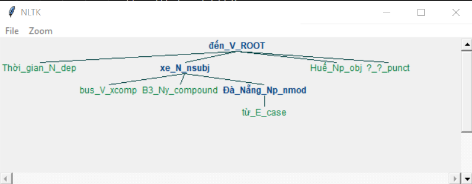

# Natural Language Processing Assignment
## A Simple Reply System

If you are reading the raw README.md, you'd better visit [This GitHub Project](https://github.com/ghostbbbmt/NLP2017_Assignment) to have a better, clearer README :)

### 1. Description
This project is a reply system about flights' information using natural language techniques. 

The input is a question in natural language (English). The question will be analyzed to logical form, then the logical structure is parsed to procedure semantics form.

With a query as the above procedure semantics form, the system will lookup in the database and return the result of the input question.


Here is the simple version with below grammar rules from the assignment's description:
 ```
S → WH-QUERY FLIGHT-NP FLIGHT-VP
FLIGHT-NP → DET FLIGHT-CNP
FLIGHT-NP → FLIGHT-CNP
FLIGHT-CNP → FLIGHT-N
FLIGHT-CNP → FLIGHT-CNP FLIGHT-DEST
FLIGHT-TIME → TIME-MOD │P-TIME TIME-MOD
FLIGHT-VP → FLIGHT-V
FLIGHT-VP → FLIGHT-V FLIGHT-TIME
CITY-NP → CITY-NAME CITY-N
CITY-NP → DET CITY-N
FLIGHT-DEST → to CITY-NP
FLIGHT-DEST→ for CITY-NP
WH-QUERY → what time │ when does │ which
DET → the
FLIGHT-N→ flight
P-TIME → at │on │in
CITY-NAME → Hồ Chí Minh │ Huế
```

### 2. Prerequisites:
- Python 3.5
- [NLTK 3.2](http://www.nltk.org) 


### 3. System structure
There are 4 python files as 4 modules:
- [main.py](main.py) : The start point of the program.
- [nlp_parser.py](nlp_parser.py) : Parser module. Include a function that parse logical structure to procedure semantics form.
- [nlp_data.py](nlp_data.py) : Database module. Define the given dataset and provide lookup function for answering the question.
- [nlp_file.py](nlp_file.py) : File module. Write answers to text files as required.

Other files:
- [grammar.fcfg](grammar.fcfg) : The free context grammar file that defines grammar rules for parser. This contains not only all predefined rules from the assignment's description but contains also extra rules which I think necessary for grammar regulization and they help the parser can parse all the possible natural questions smoothly. All the rules are described by SEM structure which is close to the textbook. 
Some special cases:
  - VP, NP, N,... have their own VAR variable
  - WHQUERY has GAP
  - VP and some rules have lamda expression
 - [de.txt](de.txt) : The file that contains the question that I completed. Don't care about it.
 - 1712177.zip : The zip file contains submited project. 
 - [README.md](README.md) : This file, obiviously :)

### 4. Installation
#### There are two ways of running the program:
Use default arguments:
```sh
$python3 main.py
```
Use custom arguments: 
```sh
$python3 main.py --question [question] --rule_file_name [rule_file_name] --language ['english','vietnamese'] --visualize ['on','off']
```
Usage:
- ```--question``` : The input question in English or Vietnamese. Default: "*Which flight to Huế city arrives at 20:00HR ?*"
-  ```--rule_file_name``` : The context free grammar file (.fcfg). Default: *grammar.fcfg*
- ``` --language ``` : english or vietnamese, (the default option is Vietnamese)
- ``` --visualize ``` : Visualize the SpaCy dependency tree with nltk.tree, you can choose to turn on or off this feature by pass this to command line --visualize 'on' (or 'off')  (the default option is "Off" )
#### Important note !!!
You might unable to run the program when input vietnamese text into the command line, and the debug console show something like this :
```
UnicodeEncodeError: 'charmap' codec can't encode characters in position 2-3: character maps to <undefined>
```
that because the command windows doesn't speak Vietnamese yet (at this time for sure, lmao). In order to fix that, you might want to try this command:
```sh
chcp 65001
```
also if it doesn't work try to set the config of your local machine's python to encoding='utf-8' it will also help to.

If the grammar rules is correct and the question can be parsed, all the results of 5 phases (*1.create parser, 2.create parsed tree, 3.create logical form, 4.create procedure semantics form, 5.query result*) will be printed as well as written to files.

#### Dependency grammar Installation:
1. Install spaCy
```bash 
pip install spacy==2.2.3
```
2. Install pyvi
```bash
pip install pyvi
```
3. Download vivi model directly using pip:
```bash 
pip install https://github.com/trungtv/vi_spacy/raw/master/packages/vi_spacy_model-0.2.1/dist/vi_spacy_model-0.2.1.tar.gz
```
4. Run this command or manually copy the vivi model package that you has just downloaded in step 3 into ... folder.
```bash 
python -m spacy link vi_spacy_model vi_spacy_model
```
##### spaCy doc
For more infomation please refer to https://spacy.io/usage for documentation
and https://spacy.io/api/annotation#pos-tagging (Syntactic Dependency Parsing/Universal Part-of-speech Tags) , https://universaldependencies.org/vi/dep/  for tag definition.
### 5. Result
##### Database:
These information are given from the assignment's description:

| FLIGHT    | ARRIVAL TIME          | DEPARTURE TIME        |
|-----------|-----------------------|-----------------------|
| FLIGHT F1 | ATIME F1 HUE 17:00HR  | DTIME F1 HCMC 15:00HR |
| FLIGHT F2 | ATIME F2 HCMC 16:00HR | DTIME F2 HUE 14:30HR  |
| FLIGHT F3 | ATIME F3 HUE 20:00HR  | DTIME F3 HCMC 18:30HR |
| FLIGHT F4 | ATIME F4 HCMC 10:00HR | DTIME F4 HUE 8:30HR   |

##### Result of the assignment (default parameters):
Question:
```
Thời gian xe bus B3 từ Đà Nẵng đến Huế ?
```
Parsed tree (style: python list format) (in [output_b.txt](output_b.txt)) look something like this : 
```
[Tree('đến_V_ROOT', ['Thời_gian_N_dep', Tree('xe_N_nsubj', ['bus_V_xcomp', 'B3_Ny_compound', Tree('Đà_Nẵng_Np_nmod', ['từ_E_case'])]), 'Huế_Np_obj', '?_?_punct'])]
Token def.
a. token.text, b. token.lemma_, c. token.pos_, d. token.tag_, e. token.dep_, f.token.shape_, g. token.is_alpha, h. token.is_stop
0. a.Thời_gian, b.Thời_gian, c.X, d.N, e.dep, f.xxxxxxxxx, g.False, h.True
1. a.xe, b.xe, c.X, d.N, e.nsubj, f.xx, g.True, h.False
2. a.bus, b.bus, c.X, d.V, e.xcomp, f.xxx, g.True, h.False
3. a.B3, b.B3, c.X, d.Ny, e.compound, f.xx, g.False, h.False
4. a.từ, b.từ, c.X, d.E, e.case, f.xx, g.True, h.True
5. a.Đà_Nẵng, b.Đà_Nẵng, c.X, d.Np, e.nmod, f.xxxxxxx, g.False, h.False
6. a.đến, b.đến, c.X, d.V, e.ROOT, f.xxx, g.True, h.True
7. a.Huế, b.Huế, c.X, d.Np, e.obj, f.xxx, g.True, h.False
8. a.?, b.?, c.X, d.?, e.punct, f.?, g.False, h.False
```
Console output
```
Token def.
a. token.text, b. token.lemma_, c. token.pos_, d. token.tag_, e. token.dep_, f.token.shape_, g. token.is_alpha, h. token.is_stop
0. b.Thời_gian, b.Thời_gian, c.X, d.N, e.dep, f.xxxxxxxxx, g.False, h.True
1. b.xe, b.xe, c.X, d.N, e.nsubj, f.xx, g.True, h.False
2. b.bus, b.bus, c.X, d.V, e.xcomp, f.xxx, g.True, h.False
3. b.B3, b.B3, c.X, d.Ny, e.compound, f.xx, g.False, h.False
4. b.từ, b.từ, c.X, d.E, e.case, f.xx, g.True, h.True
5. b.Đà_Nẵng, b.Đà_Nẵng, c.X, d.Np, e.nmod, f.xxxxxxx, g.False, h.False
6. b.đến, b.đến, c.X, d.V, e.ROOT, f.xxx, g.True, h.True
7. b.Huế, b.Huế, c.X, d.Np, e.obj, f.xxx, g.True, h.False
8. b.?, b.?, c.X, d.?, e.punct, f.?, g.False, h.False

NLTK spaCy Parse Tree
                           đến_V_ROOT
        _______________________|________________________
       |            |          |                    xe_N_nsubj
       |            |          |            ____________|_______________
       |            |          |           |            |        Đà_Nẵng_Np_nmod
       |            |          |           |            |               |
Thời_gian_N_dep Huế_Np_obj ?_?_punct  bus_V_xcomp B3_Ny_compound    từ_E_case

```
If you choose the --visualize 'on' parameter, the output will draw this tree:


Parsed logical form (in [output_c.txt](output_c.txt))
```
blank
```

Parsed procedure semantics form (in [output_d.txt](output_d.txt))
```
blank
```

Result (in [output_e.txt](output_e.txt))
```
blank
```

##### Result of the assignment (when the language parameter was the string 'english'):
Question:
```
Which flight to Huế city arrives at 20:00HR ?
```
Parsed tree (in [output_b.txt](output_b.txt))
```
(S[GAP=<f2>, SEM=<WHQUERY(ARRIVE1(a3,f2,TIME(t2,20:00HR)),(FLIGHT1(f2) & DEST(f2,NAME(h3,'Hue'))),WH(f2,WHICH1))>, VAR=<a3>]
  (WHICH-QUERY[SEM=<\x.WH(x,WHICH1)>] Which)
  (FLIGHT-NP[SEM=<(FLIGHT1(f3) & DEST(f3,NAME(h2,'Hue')))>, VAR=<f3>]
    (FLIGHT-CNP[SEM=<(FLIGHT1(f2) & DEST(f2,NAME(h3,'Hue')))>, VAR=<f2>]
      (FLIGHT-CNP[SEM=<FLIGHT1(f2)>, VAR=<f2>]
        (FLIGHT-N[SEM=<FLIGHT1>, VAR=<f1>] flight))
      (FLIGHT-DEST[SEM=<\f.DEST(f,NAME(h2,'Hue'))>, VAR=<h2>]
        to
        (CITY-NP[SEM=<NAME(h3,'Hue')>, VAR=<h3>]
          (CITY-NAME[SEM=<'Hue'>, VAR=<h2>] Huế)
          (CITY-N[SEM=<CITY>, VAR=<c1>] city)))))
  (FLIGHT-VP[SEM=<\r f.ARRIVE1(r,f,TIME(t3,20:00HR))>, VAR=<a2>]
    (FLIGHT-V[SEM=<\r f t.ARRIVE1(r,f,t)>, VAR=<a2>]
      (ARRIVE-V[SEM=<\r f t.ARRIVE1(r,f,t)>, VAR=<a1>] arrives))
    (FLIGHT-TIME[SEM=<TIME(t2,20:00HR)>, VAR=<t2>]
      (P-TIME[SEM=<AT>] at)
      (TIME-MOD[SEM=<20:00HR>, VAR=<t1>] 20:00HR))))
```

Parsed logical form (in [output_c.txt](output_c.txt))
```
WHQUERY(ARRIVE1(a3 f2 TIME(t2 20:00HR)) (FLIGHT1(f2) & DEST(f2 NAME(h3 'Hue'))) WH(f2 WHICH1))
```

Parsed procedure semantics form (in [output_d.txt](output_d.txt))
```
(PRINT-ALL ?f2(FLIGHT ?f2)(ATIME ?f2 HUE 20:00HR)(DTIME ?f2 ?sd ?td))
```

Result (in [output_e.txt](output_e.txt))
```
F3
```


##### Other test:
##### Test 1:
Question:
```
Which flight from Hồ Chí Minh city depart at 15:00HR?
```
Parsed tree:
```
(S[GAP=<f3>, SEM=<WHQUERY(DEPART1(d3,f3,TIME(t2,15:00HR)),(FLIGHT1(f3) & SOURCE(h2,NAME(h2,'HoChiMinh'),f3)),WH(f3,WHICH1))>, VAR=<d3>]
  (WHICH-QUERY[SEM=<\x.WH(x,WHICH1)>] Which)
  (FLIGHT-NP[SEM=<(FLIGHT1(f2) & SOURCE(h3,NAME(h3,'HoChiMinh'),f2))>, VAR=<f2>]
    (FLIGHT-CNP[SEM=<(FLIGHT1(f3) & SOURCE(h2,NAME(h2,'HoChiMinh'),f3))>, VAR=<f3>]
      (FLIGHT-CNP[SEM=<FLIGHT1(f2)>, VAR=<f2>]
        (FLIGHT-N[SEM=<FLIGHT1>, VAR=<f1>] flight))
      (FLIGHT-SOURCE[SEM=<SOURCE(h3,NAME(h3,'HoChiMinh'))>, VAR=<h3>]
        from
        (CITY-NP[SEM=<NAME(h2,'HoChiMinh')>, VAR=<h2>]
          (CITY-NAME[SEM=<'HoChiMinh'>, VAR=<h1>] Hồ Chí Minh)
          (CITY-N[SEM=<CITY>, VAR=<c1>] city)))))
  (FLIGHT-VP[SEM=<\r f.DEPART1(r,f,TIME(t3,15:00HR))>, VAR=<d2>]
    (FLIGHT-V[SEM=<\r f t.DEPART1(r,f,t)>, VAR=<d2>]
      (DEPARTURE-V[SEM=<\r f t.DEPART1(r,f,t)>, VAR=<d1>] depart))
    (FLIGHT-TIME[SEM=<TIME(t2,15:00HR)>, VAR=<t2>]
      (P-TIME[SEM=<AT>] at)
      (TIME-MOD[SEM=<15:00HR>, VAR=<t1>] 15:00HR))))
```

Parsed logical form:
```
WHQUERY(DEPART1(d3 f3 TIME(t2 15:00HR)) (FLIGHT1(f3) & SOURCE(h2 NAME(h2 'HoChiMinh') f3)) WH(f3 WHICH1))
```

Parsed procedure semantics form:
```
(PRINT-ALL ?f3(FLIGHT ?f3)(ATIME ?f3 ?sa ?ta)(DTIME ?f3 HCMC 15:00HR))
```

Result:
```
F1
```

##### Test 2:
Question:
```
When does the flights to Huế city arrive?
```
Parsed tree:
```
(S[GAP='t1', SEM=<WHQUERY(ARRIVE1(a2,f2,TIME(t1)),THE((FLIGHT1(f2) & DEST(f2,NAME(h3,'Hue')))),WH(t1,WHEN1))>, VAR=<a2>]
  (TIME-QUERY[SEM=<\x.WH(x,WHEN1)>] When does)
  (FLIGHT-NP[SEM=<THE((FLIGHT1(f3) & DEST(f3,NAME(h2,'Hue'))))>, VAR=<f3>]
    (DET[SEM=<THE>] the)
    (FLIGHT-CNP[SEM=<(FLIGHT1(f2) & DEST(f2,NAME(h3,'Hue')))>, VAR=<f2>]
      (FLIGHT-CNP[SEM=<FLIGHT1(f2)>, VAR=<f2>]
        (FLIGHT-N[SEM=<FLIGHT1>, VAR=<f1>] flights))
      (FLIGHT-DEST[SEM=<\f.DEST(f,NAME(h2,'Hue'))>, VAR=<h2>]
        to
        (CITY-NP[SEM=<NAME(h3,'Hue')>, VAR=<h3>]
          (CITY-NAME[SEM=<'Hue'>, VAR=<h2>] Huế)
          (CITY-N[SEM=<CITY>, VAR=<c1>] city)))))
  (FLIGHT-VP[SEM=<\r f t.ARRIVE1(r,f,TIME(t))>, VAR=<a3>]
    (FLIGHT-V[SEM=<\r f t.ARRIVE1(r,f,t)>, VAR=<a2>]
      (ARRIVE-V[SEM=<\r f t.ARRIVE1(r,f,t)>, VAR=<a1>] arrive))))
```

Parsed logical form:
```
WHQUERY(ARRIVE1(a2 f2 TIME(t1)) THE((FLIGHT1(f2) & DEST(f2 NAME(h3 'Hue')))) WH(t1 WHEN1))
```

Parsed procedure semantics form:
```
(PRINT-ALL ?t1(FLIGHT ?f2)(ATIME ?f2 HUE ?t1)(DTIME ?f2 ?sd ?td))
```

Result:
```
17:00HR 20:00HR
```
### 6. Future development
- Add TENSE (PAST, PRESENT,...) to grammar.
- Add  -INV, +INV.
- Add PLURAL/SINGULAR comparison to grammar.
- More regulization to handle more questions.
- Better grammar rules. Current rules are a little bit confusing.
- Vietnamese support?!?.
- Maybe chat bot like this. why not? :)


